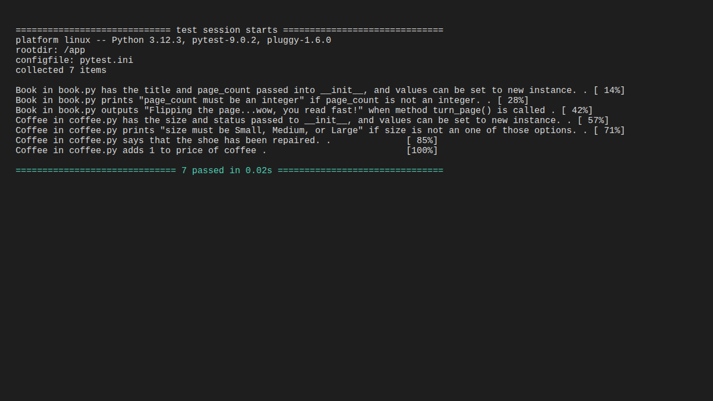

# Object Oriented Programming Lab - Bookstore

This repository contains a simple model for a Bookstore, featuring `Book` and `Coffee` classes implemented in Python.

## Features

### Book
- **Attributes**: `title`, `page_count`
- **Validation**: `page_count` must be an integer.
- **Methods**: `turn_page()` - Prints a message about flipping the page.

### Coffee
- **Attributes**: `size`, `price`
- **Validation**: `size` must be "Small", "Medium", or "Large".
- **Methods**: `tip()` - Increases the price by 1 and prints a thank-you message.

## Installation

1. Clone the repository.
2. Install dependencies:
   ```bash
   pipenv install
   ```
3. Enter the virtual environment:
   ```bash
   pipenv shell
   ```

## Usage

```python
from lib.book import Book
from lib.coffee import Coffee

# Create a book
my_book = Book("The Great Gatsby", 180)
my_book.turn_page()

# Create a coffee
my_coffee = Coffee("Large", 4.50)
my_coffee.tip()
print(f"New price: {my_coffee.price}")
```

## Testing

Tests are located in the `lib/testing` directory and can be run using `pytest`:

```bash
pytest lib/testing/book_test.py
pytest lib/testing/coffee_test.py
```



## License
MIT
